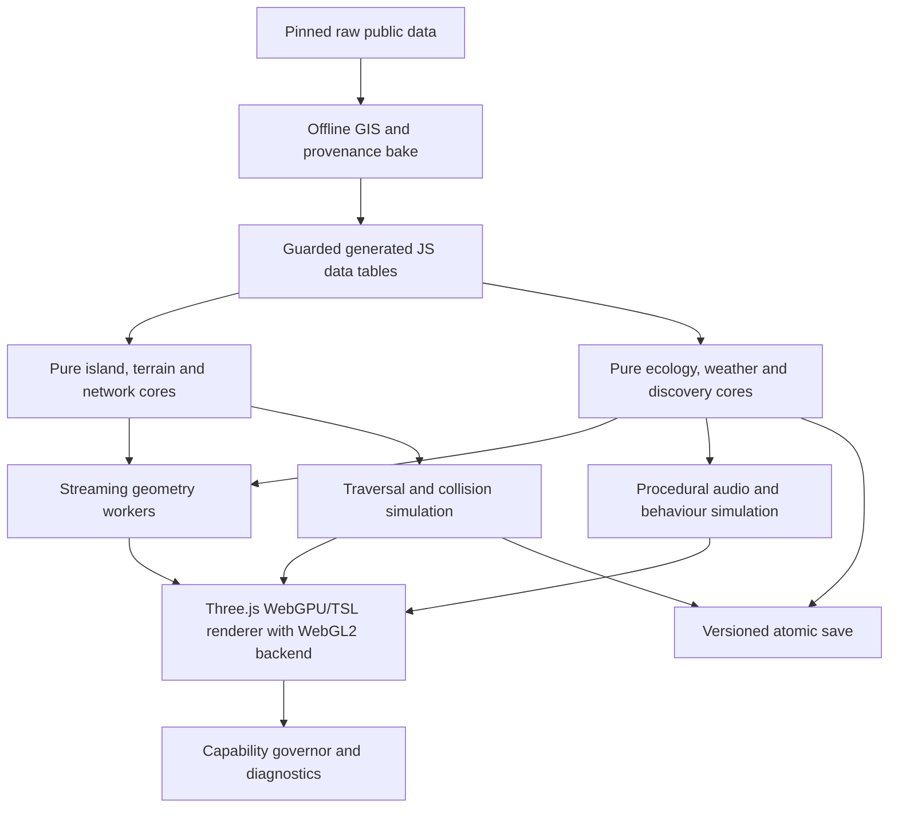
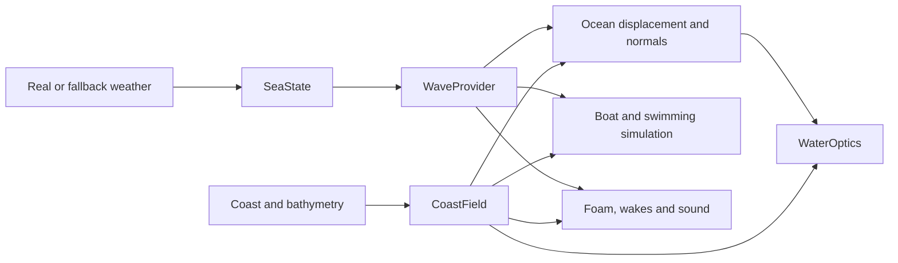

# Androsstead — product and technical design

- **Status:** Draft for owner review
- **Date:** 9 August 2026
- **Decision owner:** James Cockburn
- **Assurance tier:** Tier B — durable user-facing product
- **Target:** ambitious two-week playable alpha, followed by evidence-led expansion
- **Runtime:** browser-first, procedural-only, zero shipped binary assets

## 1. Executive decision

Androsstead is an exploration and archaeology game set on a faithful, deliberately
compressed recreation of Andros, Greece. The player can walk the island's real trail
network, drive its coastal roads, sail or use a speedboat around the coast, swim,
discover plants and animals, and excavate archaeological sites that unlock explorable
reconstructions of the past.

The game keeps the geographical truth that affects recognition and navigation—coast,
relief, ridges, settlements, route topology, beaches, landmark relationships and
archaeological coordinates—while compressing travel distance. Roads, paths, buildings,
vehicles, caves and hero locations remain human-scale. It is a topological cartogram,
not a miniature model in which everything is uniformly shrunk.

The island is a smooth continuous Three.js world, never voxel or visibly faceted.
Large-scale landscape, roads and ordinary settlements remain continuous. Places that
need near-real scale and much greater detail stream into nested local worlds through
natural thresholds without becoming disconnected levels. The initial hero set is:

- Foros Cave;
- Pithara waterfalls;
- Chora's Lower Castle and Tourlitis lighthouse;
- one fully playable archaeological excavation and reconstruction.

The existing Stead games are sources, not templates. Androsstead will retain the best
proven pure-core boundaries, deterministic generation, terrain streaming, water-wave
maths, lighting/shadow stability, post-processing lifecycle, save discipline and
capability governance. It will not inherit their location-specific physics, terrain
skin, world content, or flora and fauna visuals.

The last point is categorical: the existing sibling flora and fauna are an
unsatisfactory visual baseline. Primitive blob/tube/cross-card plants, dot birds,
sphere-and-cone animals and their simplified animation grammar must not be ported.
Only useful non-visual infrastructure—stable seeds, ecological placement boundaries,
streaming, pooling, LOD switching and performance tests—may be adapted. Androsstead's
organisms require new species-led geometry, animation, behaviour and habitat systems.

## 2. Product contract

### 2.1 Critical player journey

The critical journey is:

1. Open the web game and enter the island on an appropriate graphics profile.
2. Travel by foot, car or boat through a recognisable, continuous Andros.
3. Notice an environmental, historical or archaeological clue without a quest arrow.
4. Observe or survey it and add a sourced entry to the Field Book.
5. Excavate a site stratigraphically, catalogue finds and form an interpretation.
6. Enter the resulting ancient reconstruction with evidence certainty visible on
   request.
7. Leave, continue exploring, and resume from a valid saved state after reload.

A release claim is not proved by a build or title screen. It is proved by a browser
test of this first-use journey on representative high, mid and weak hardware profiles.

### 2.2 Product pillars

1. **A recognisable Andros.** Real topography and topology are more important than raw
   scale or indiscriminate detail.
2. **Travel that is itself fun.** Walking, driving, sailing, speedboating and swimming
   are first-class play, not transitions between icons.
3. **Archaeology through interpretation.** Evidence, context and uncertainty matter;
   the player does not loot or sell artefacts.
4. **Discovery through attention.** Sound, light, ecology, landform and architecture
   lead the player. The map helps travel without spoiling hidden discoveries.
5. **A living field guide.** Education is the reward system, expressed as a kid-friendly
   collectathon rather than lessons pasted over the game.
6. **Beauty without hardware exclusion.** The highest profile should be exceptional,
   but every supported 3D profile preserves the whole island and all mechanics.

### 2.3 Success criteria

The alpha succeeds when:

- the island footprint is 18.42 km², twice Moorstead's measured 9.21 km²;
- Andros is recognisable from its coast, major relief, settlement positions and route
  relationships without a label overlay;
- verified roads and walking routes form navigable connected networks after deliberate
  simplification;
- a full circuit can combine car, foot and boat travel without a loading-screen menu;
- coastal driving includes physical cliff danger and a mild, non-fatal recovery;
- live Andros weather, wind and light work, with visibly labelled cached and
  deterministic climate fallbacks;
- Foros, Pithara and Chora are distinct hero-quality spaces;
- one excavation-to-reconstruction loop is complete;
- the new flora/fauna system is visibly species-led and is not mistaken for the
  siblings' primitive procedural style;
- cicada sound varies smoothly and plausibly with habitat, weather and location;
- the Fine profile sustains a measured 60 fps target on its calibrated hardware class;
- a Plain profile retains all roads, trails, collision, discoveries and archaeology;
- generation, licensing, save compatibility and the zero-binary rule are enforced by
  the canonical verification command.

### 2.4 Non-goals for the alpha

- a one-to-one island with real travel times;
- photogrammetry, scanned models, shipped textures, recorded ambience or other binary
  runtime media;
- a complete interior for every building;
- a fully simulated individual animal for every visible distant animal;
- destructive archaeology, antiquities trading, human injury or character death;
- a claim that inferred cave extensions or reconstructed structures are observed fact;
- WebGPU-only rendering or mandatory `SharedArrayBuffer`;
- multiplayer or a live service beyond optional weather retrieval.

## 3. Truth, inference and invention

Androsstead must remain honest about what it recreates. Every geographic, historical,
ecological and interpretive datum carries structured provenance:

```text
claim or feature
  -> source identifier and version
  -> source licence/permission
  -> source coordinate or pinpoint
  -> acquisition date
  -> transformation history
  -> certainty: observed | attested | inferred | speculative | gameplay-compressed
```

The default presentation is a coherent world, not a wireframe disclaimer. The Field
Book and reconstruction overlay expose the distinctions. A player can toggle the
reconstruction certainty overlay between:

- **attested:** directly evidenced by surveyed remains, excavation or a reliable
  primary/authoritative account;
- **inferred:** a defensible completion based on comparative evidence or missing
  portions of a known structure;
- **speculative:** an illustrative possibility required to make the space playable;
- **compressed:** real topology or sequence whose distance has been reduced.

Conflicting credible sources remain separate in the data manifest. They are not
silently averaged. Missing evidence remains null. Folklore is attributed as folklore,
not converted into a zoological or historical fact.

## 4. Scale and coordinate law

### 4.1 Locked scale

Moorstead's measured world is approximately 3.73 km by 2.47 km, or 9.21 km².
Androsstead's continuous island world is exactly twice that area: **18.42 km²**. Its
target island-aligned footprint is approximately **6.6 km by 2.8 km**, subject to the
coast mesh closing at the required area rather than an artificial bounding rectangle.

The design begins around these compression ratios:

- island plan distance: approximately 1:6 along the major travel axes;
- relief: approximately 1:4, retaining the island's steepness and coastal drama;
- roads, trails, cars, boats, people, doors and ordinary buildings: real human scale;
- hero worlds: near 1:1 locally, with their own disclosed transform.

The ratios are not licences for arbitrary distortion. The bake solves a constrained
cartogram against protected anchors and network topology.

### 4.2 Canonical transformations

All authoritative source geometry is preserved in WGS84 and projected into one pinned,
metre-based Greek/local coordinate reference system during the offline bake. The bake
then applies one versioned `realToIsland()` transformation. Terrain, road meshes,
path meshes, collision, routing, buildings, discoveries, vegetation habitats and audio
fields consume that same result. No renderer module performs an independent scaling
guess.

Every hero world stores:

```text
real WGS84 anchor
island-world anchor
island entry frame and boundary
local near-1:1 transform
return transform
transform version
```

Round-trip and cross-layer parity are verification gates. A coordinate used for a road
cannot produce a different height or coastline side in driving physics.

### 4.3 Protected constraints

The cartogram and network simplifier must preserve:

- coast order, cape/bay order and island handedness;
- ridge, watershed and valley relationships;
- Gavrio, Batsi, Chora, Korthi and other retained settlement order and relative side of
  the island;
- every retained junction's degree and route ordering;
- bridge/tunnel/ford/grade separation semantics;
- archaeological, beach, cave, waterfall and Chora landmark anchors;
- coastal road exposure where cliff-edge driving is part of the real route character;
- trail/road intersections needed for exploration loops;
- route continuity through villages even when street detail is reduced.

The simplifier may remove redundant bends, minor spurs and low-value parallel streets,
and may shorten long empty segments. It must not invent a junction, merge non-crossing
routes, move a landmark across a ridge, or make a dangerous real sequence topologically
safe. Exaggerated road and path widths are deliberate usability symbols in the
compressed world and are disclosed in the Field Book's cartography note.

## 5. System architecture

### 5.1 Boundaries

The implementation retains Marsstead's strongest architectural lesson: deterministic
pure cores produce data; Three.js layers consume it. It does not copy Marsstead's large
coordinator or Mars-specific modules.



The intended source boundaries are:

- `src/geo/`: projection, cartogram and coordinate parity;
- `src/world/`: terrain/coast height truth, networks, buildings and hero anchors;
- `src/sim/`: character, car, sailboat, speedboat, swimming, collision and recovery;
- `src/ecology/`: habitats, species grammars, populations and behaviour;
- `src/weather/`: live/cached/climate state and derived physical fields;
- `src/water/`: sea state, wave providers, coast field, clipmap, optics and bounded
  surface memory;
- `src/audio/`: procedural sources, mixing, habitat chorus and acoustics;
- `src/archaeology/`: survey, stratigraphy, finds, interpretation and reconstruction;
- `src/fieldbook/`: discoveries, educational provenance and collection progress;
- `src/render/`: shared Three.js materials, batching, LOD, lighting and node post;
- `src/heroes/`: bounded Foros, Pithara, Chora and reconstruction packages;
- `src/platform/`: capability probe, governor, storage, updates and diagnostics.

Hand-written source files are capped at 300 logical lines and gated. Generated tables,
pinned vendored shader functions and licence texts are explicit exceptions. `main.js`
coordinates modules; it does not absorb their logic.

### 5.2 Main thread and workers

The renderer and Web Audio graph live on the main thread. Transferable workers handle
terrain tessellation, road/building mesh arrays, plant variant generation, distant
population transforms and data decode. Results are versioned and cancellable; late
results for an evicted cell are discarded. Core correctness does not depend on
`SharedArrayBuffer` or cross-origin isolation.

## 6. Data pipeline, sources and licensing

### 6.1 Runtime asset contract

The shipped game contains no binary textures, models, heightmaps, audio recordings,
photos, video, WASM or tile archives. Offline tools may read lawful source rasters and
vectors. They emit deterministic generated JavaScript/Base64 numeric tables and compact
metadata. Runtime textures, impostors, noise fields and audio buffers are generated in
the browser from source code and seeds.

Generated sources are separated by responsibility so ordinary changes do not rewrite a
monolith:

- `andros-terrain-data.js` — elevation, coast and bathymetry basis;
- `andros-network-data.js` — roads, paths, watercourses and settlements;
- `andros-built-data.js` — footprints, building grammar inputs and landmarks;
- `andros-ecology-data.js` — land cover, habitat evidence and species constraints;
- `andros-archaeology-data.js` — sourced sites and reconstruction evidence;
- `andros-climate-data.js` — deterministic climatology fallback;
- `andros-provenance-data.js` — feature-to-source and licence manifest.

Each file has one generator, an edit guard, a schema/version header and a regenerate-and-
diff verification. Raw downloads remain outside the runtime and are pinned by URL,
licence, date and checksum in a reproducible manifest.

### 6.2 Data source policy

The initial authoritative hierarchy is:

| Domain | Primary source and use | Constraint |
|---|---|---|
| Elevation | Copernicus DEM GLO-30 or better lawfully reusable public DEM | Preserve source credit and known vertical limitations |
| Coast, roads, paths, buildings, land use | OpenStreetMap extracts | ODbL attribution; derived database obligations assessed and recorded |
| Land cover | ESA WorldCover | CC BY 4.0 attribution; ecology is derived, not copied blindly |
| Offshore depth | GEBCO where resolution supports safe approximation | Attribute; explicitly not for navigation |
| Trails | OSM route relations plus official/public route descriptions for validation | Official Andros Routes GPX/map is not copied unless separately licensed |
| Weather | Open-Meteo Andros grid data | Follow current attribution/terms; label live/cached/climate state |
| Archaeology | Greek Ministry/cultural institutions, excavation publications and site scholarship | No invented plan; record pinpoints and certainty |
| Ecology | peer-reviewed/authoritative species and habitat sources | Presence does not imply arbitrary abundance |
| Folklore | attributed local/cultural sources | Presented as tradition or testimony, never observed fact |

The official Andros Routes material is commercially sold and rights-reserved. It may be
used to verify public facts or after permission, but OSM relations are the lawful
initial geometry source. Similarly, online photographs are visual research references,
not runtime assets or traceable texture/model inputs.

`THIRD_PARTY_NOTICES.md`, an in-game credits panel and the provenance manifest are
release requirements. A source cannot enter the bake until its licence and required
credit are explicit.

### 6.3 Offline toolchain

The GIS build uses pinned versions of GDAL, Rasterio, pyproj, pyosmium, Shapely and
NetworkX in a reproducible environment. The build performs:

1. source checksum and licence validation;
2. projection and coast/elevation reconciliation;
3. constrained island cartogram solve;
4. topology-aware road and trail simplification;
5. terrain, watercourse, settlement and habitat sampling;
6. protected-anchor and network invariants;
7. quantisation with recorded error bounds;
8. generated table emission and deterministic regeneration comparison.

## 7. Three.js and open-source architecture decision

### 7.1 Engine decision

Androsstead uses **exactly pinned `three@0.185.1` with `WebGPURenderer`, node materials
and TSL** for the alpha. WebGPU is the preferred backend; Three's WebGL2 backend is the
supported fallback through the same renderer and material graph. There is no parallel
classic `WebGLRenderer` implementation. Production imports use `three/webgpu` and
`three/tsl`, and the fallback is exercised explicitly with `forceWebGL`.

This reverses the original WebGL-first decision because transparent Greek shallows,
depth-aware refraction, generated caustics and persistent wakes are central rather than
decorative. Three r185 now supplies the required reflector node, shared viewport colour
and depth nodes, MRT/node post-processing and storage-buffer compute primitives. It
also retains the existing Stead advantages: procedural `BufferGeometry`, direct scene
control and a pure-core/render-layer split.

Saltstead and Moorstead target older r166 WebGL shader/addon interfaces. Their pure
maths, tuned constants and lifecycle decisions are extracted, but their
`onBeforeCompile`, raw GLSL, classic render-target and `EffectComposer` code is not
copied. The renderer-facing work is re-expressed as bounded TSL/node modules and covered
by native-WebGPU and forced-WebGL compile/live tests. No version-sensitive source block
is assumed compatible.

`WebGPURenderer` remains described as experimental by Three. The control is an exact
version pin, a deliberately limited feature surface, conservative boot calibration,
tested fallback and no mid-alpha Three upgrade. Raw WebGPU/WGSL is rejected: compute
and materials stay within Three's TSL abstraction unless a separately approved design
proves that TSL cannot express a required operation.

Babylon.js and PlayCanvas are capable but a migration would discard valuable Stead
domain work without solving GIS compression or zero-asset ecology. Cesium and MapLibre
are tile/map architectures rather than the required compressed game world. Godot adds
a WASM/web delivery boundary and weakens direct reuse.

### 7.2 Library selection matrix

| Component | Decision | Exact role |
|---|---|---|
| Three.js r185 `WebGPURenderer` + TSL | Adopt/pin | WebGPU-first renderer, WebGL2 backend, node materials, compute and post-processing |
| Three `TreeGenerator` algorithm | Adapt under Three MIT | Branch skeleton, taper, pipe radii, frames, phototropism, flare and procedural variation; use Andros TSL material |
| Three `ForestGenerator` | Do not use its geometry | Study/adapt only density, clearing and stochastic culling concepts; its blob canopy is rejected |
| `InstancedMesh` | Adopt | Same-geometry vegetation, stones and repeated built details |
| `BatchedMesh` | Adopt | Heterogeneous generated meshes sharing a material with per-object culling |
| `BufferGeometryUtils` | Adopt | Merge, tangent and geometry processing where measured useful |
| `SimplifyModifier` | Adopt selectively | Offline/session LOD production with silhouette validation |
| `SkinnedMesh`/`Skeleton` | Adopt | New articulated hero fauna and animation |
| `MeshSurfaceSampler` | Limited | Injected deterministic sampling on bounded meshes, never habitat truth |
| `SkyMesh`/sky-node basis | Adapt | Preetham daylight basis driven by real sun/weather inputs |
| `PMREMGenerator` | Adopt | Low-cadence procedural sky radiance for PBR materials |
| `LightProbeGenerator` | Conditional | Diffuse spherical-harmonic fill if benchmarked benefit exceeds cost |
| TSL `reflector()`/`WaterMesh` reference | Adapt | Budgeted planar sea reflection architecture, not the stock final material |
| `viewportSharedTexture` and depth nodes | Adopt | Depth-rejected refraction, transmission and underwater transition without a second scene render |
| `CSMShadowNode` | Benchmark only | Compare two-cascade reach/quality with Moor's stable snapped single-sun shadow rig; never run both |
| Three node post stack + Moor lifecycle | Adapt | MRT render, bloom, output, AA and restrained grade with corrected ownership/order |
| Salt wave/glitter/shore maths | Extract/adapt | CPU/TSL height-gradient parity, Cox–Munk glitter, Fresnel and shoreline coupling |
| Three TSL compute/storage APIs | Adopt selectively | Bounded persistent foam, boat wakes, pool disturbances and waterfall impacts |
| `three-mesh-bvh@0.9.14` | Adopt/pin | Static caves, ruins, buildings, picking and capsule collision; not terrain height truth |
| `flatbush@4.6.2` | Adopt/pin | Static spatial index for cells, routes and discoveries |
| `fflate@0.8.3` | Adopt/pin | Generated-data decode where compression pays |
| `earcut@3.2.3` | Adopt/pin | Polygon and footprint triangulation |
| `stegu/psrdnoise` selected algorithm | Port/pin under MIT | TSL world-space differentiable noise for non-repeating surface fields; no raw GLSL runtime path |
| `@three.ez/instanced-mesh@0.3.16` | Benchmark, provisional | Per-instance BVH/culling/LOD/shadow LOD and optional skinning; native fallback required |
| `three-pathfinding@1.3.0` | Conditional | Bounded hero/local navmeshes only |
| `cannon-es@0.20.0` | Spike only | Compare vehicle/boat contact behaviour against a retuned deterministic core |
| TSL compute for distant spectacle | Experiment only | Distant non-interactive flock/particle motion, never core animal state |

The official r185 `TreeGenerator` is materially better than the siblings' tree
geometry, but it creates branches rather than an Andros-ready tree. We adapt the
deterministic geometry algorithm under the Three MIT licence, keep it renderer-neutral,
and supply new species-specific foliage and TSL materials. `ForestGenerator` is explicitly not
a shortcut: its intentionally low-face teardrop trees reproduce the unwanted generic
look.

`@three.ez/instanced-mesh` earns a targeted compatibility benchmark because it offers
per-instance culling, LOD, sorting, uniforms, shadow LOD and skinning. It becomes a core
dependency only if custom procedural TSL, alpha foliage, shadow behaviour, context
recovery and r185 compatibility all pass. Native `InstancedMesh` and cell-level
`BatchedMesh` remain the supported fallback.

The following are rejected for the alpha:

- `@dgreenheck/ez-tree` as a dependency: large, texture-oriented and unnecessary when
  the official branch algorithm plus bespoke foliage is leaner;
- Three's `ForestGenerator` mesh and stock Water/Water2/WaterMesh/Water2Mesh as the
  final visual material; their TSL reflection/refraction plumbing is reference code,
  while Andros uses generated normals and the Salt wave/shore contract;
- classic `WebGLRenderer`, `ShaderMaterial`, `onBeforeCompile`, `EffectComposer`,
  `Refractor`, `WaterRefractionShader`, `GPUComputationRenderer` and WebGL `CSM` paths;
- `SSRNode` as the open-sea reflection contract: screen-space reflection loses
  off-screen cliffs and sky and breaks at the horizon; it remains a later bounded
  experiment rather than a hidden alpha dependency;
- `pmndrs/postprocessing`, because the alpha uses Three's WebGPU/node post stack;
- `GroundedSkybox` and `RoomEnvironment` as outdoor lighting: both solve environment-map
  presentation rather than a real procedural Andros atmosphere;
- `three-custom-shader-material`: another shader-patch boundary conflicts with the
  already version-sensitive material and instancing paths;
- LYGIA shader code: its non-commercial licensing is inappropriate;
- stale `three-subdivide` as a core geometry dependency;
- Rapier, Recast, Ammo and Jolt browser builds because WASM violates the strict runtime
  asset contract;
- a generic MarchingCubes look for terrain, caves or animals.

Water Pro is not purchased or included. It is a visual capability benchmark only. No
package, source, bundled foam texture or reverse-engineered implementation enters the
repository. A later commercial-library decision requires a separate licence, source,
asset-contract and private-repository review.

## 8. Terrain, coast, roads and surface truth

### 8.1 Smooth terrain

The continuous island is a smooth-shaded streamed heightfield with concentric LOD
rings, analytic normals and skirts or stitch strips. It inherits the Marsstead
geography-to-pure-mesh-to-Three-layer boundary, not Mars scale, MOLA decode, palette,
procedural fictional relief or vertical exaggeration constants.

The authoritative `groundHeight(real/island coordinate)` function is shared by mesh
generation, walking, vehicles, structures and ecology. Added visual microdetail never
changes the collision surface. Cliffs needing overhangs, caves, sea arches and ruins are
bounded local meshes attached to the heightfield and accelerated by BVH.

### 8.2 Roads and trails

Road and trail meshes follow the simplified real network and sample the same terrain
truth. Cross-sections express real function rather than one generic ribbon:

- primary paved roads, village lanes and minor mountain roads;
- exposed coastal shoulders, walls, drainage and cliff edges;
- stone-paved kalderimia, dirt tracks and narrow walking paths;
- bridges, culverts, steps and water crossings where evidenced.

The mesh builder smooths unsafe numerical discontinuities but does not add invisible
guardrails. Retaining dangerous coastal edges is a product requirement. Road widths are
enlarged relative to macro geography so cars remain readable and enjoyable.

All verified marked Andros through-routes and parent routes are visible from the start.
Hidden archaeology remains undisclosed, and the final signed Pithara spur/POI is the
explicit exploration exception: its parent Route 2a is visible, while the last approach
is found through environmental cues. The trail UI distinguishes sourced route,
gameplay-compressed distance and current accessibility. It never presents the compressed
length as a real hiking time.

Beaches are retained real coast segments with sourced names, access relationships,
orientation, sediment class and exposure—not a procedural sand ring around the island.
The compression bake protects the major beach/cape/bay sequence, while the local coast
builder derives sand, pebble, rock, surf and vegetation from the evidence and wave
exposure fields.

### 8.3 Surface variation

Every major surface varies across four coordinated scales without a shipped texture:

1. **macro:** real elevation, slope, aspect, land cover, geology evidence, coast
   exposure, drainage and human use;
2. **meso:** deterministic domain-warped soil/rock patches, weathering, vegetation
   islands, moisture paths and exposure zones;
3. **micro:** world-space triplanar albedo, analytic normal, roughness, aggregate,
   grains, cracks, lichen/stains and wet response;
4. **object history:** stable building IDs, road chainage, wall orientation, age,
   maintenance and weather exposure.

All fields use metric world coordinates with high/low chunk origins so they do not
restart at cell boundaries or lose precision. Frequency bands are decorrelated and use
non-harmonic scales, domain warping, ridged/simplex/cellular combinations, and generated
blue-noise or R2 placement. Objects do not sit on grids, repeat the same yaw, or repeat
one colour sequence per chunk.

Specific material grammar includes:

- schist, marble and other sourced local rock families with bedding/exposure response;
- dry soil, compacted trail centres, loose margins and drainage stains;
- asphalt aggregate, repair history, restrained cracks, edge wear and wet roughness;
- limewashed walls with age, runoff, repaired patches and sun orientation;
- dry-stone walls with non-repeating block courses and joint darkening;
- sand-to-pebble beach transitions tied to wave exposure and coast form;
- wet rock and pool edges at Pithara with physically coherent roughness and darkening.

The gate `verify-surface-variation` samples deterministic fields and tests cross-chunk
parity, finite output, value distribution, octave energy, autocorrelation at common
cell/lattice periods, placement nearest-neighbour/cluster statistics and stable-ID
variation. A browser test compiles every shader and records an eye-level sweep across
terrain, road, village, beach and hero surfaces. Visual review remains necessary, but
it is supported by tests that catch obvious mathematical repetition.

## 9. Sea, inland water and boats

### 9.1 Water-system boundaries

There is no sibling implementation of true scene reflection/refraction to relabel as
such. Saltstead supplies the proven behavioural foundation: deterministic wave
height/gradient parity, ocean noise, Cox–Munk glitter, Fresnel response, breaking cues
and shoreline coupling. Its monolithic WebGL `ocean.js` is not ported. The alpha
extracts the pure mathematics and builds six bounded systems under `src/water/`:

- `SeaState` converts live/cached/climate wind, direction, Aegean fetch class and weather
  into deterministic swell and chop inputs;
- `WaveProvider` exposes height, gradient, breaking and band queries to render,
  buoyancy, swimming and audio; the alpha implementation is Salt's analytic spectrum;
- `CoastField` supplies signed shore distance, water depth and seabed class from the
  compressed geography;
- `OceanClipmap` draws smooth camera-centred near/mid/far rings, dense near the player
  and progressively cheaper offshore, with continuous displacement and no voxel or
  visible patch boundary;
- `WaterOptics` owns TSL reflection, refraction, absorption, scattering, glitter,
  caustics and the underwater transition;
- `SurfaceMemory` owns bounded WebGPU compute fields for persistent foam, wakes and
  impacts; the WebGL2 profile uses analytic foam and procedural wake stamps.

The authoritative flow is:



There is one water truth: a boat cannot float on a different wave from the visible
surface. Rendering quality may change presentation but never `WaveProvider`, pool depth,
buoyancy or collision outputs. A future JONSWAP/IFFT provider may implement the same
interface, but spectral FFT, spray interaction and rain-on-water simulation are outside
the alpha and cannot expand it implicitly.

### 9.2 Aegean sea geometry and optics

The sea colour arises from the actual seabed and optical path rather than a transparent
blue material:

- scene colour is refracted through the displaced surface using shared viewport colour
  and depth; depth rejection prevents foreground boats, plants or cliffs from being
  sampled beneath the water;
- Beer–Lambert absorption uses estimated travel distance through water: pale sand and
  stones remain visible in coves, then red and green attenuate progressively into deep
  Aegean blue;
- Fresnel balances transmission and reflection, clear when looking down and strongly
  reflective at grazing angles;
- Ultra/Fine combine the procedural Mediterranean sky and sun with budgeted planar
  reflection of terrain, buildings and boats; lower tiers reduce its cadence/resolution
  or omit reflected scene geometry while retaining sky, sun path and Salt glitter;
- wave focusing projects bounded caustics onto the actual seabed and submerged rock,
  fading with depth, cloud and rough water instead of repeating as a pasted texture;
- smaller capillary normals, wind streaks, glitter and foam breakup use rotated,
  incommensurate world-space procedural fields so no scrolling tile is exposed;
- signed coast distance and bathymetry drive shoaling, breaking, wet-sand run-up and
  retreat; there is no uniform white ring at the shoreline.

Clear beaches therefore require procedural seabed substance: sand, rounded stones,
rock shelves, sea grass and discoveries use real geometry/material variation visible
through the water. Crossing the sampled surface uses hysteresis to avoid flicker and
transitions continuously to underwater absorption, refraction, suspended light,
acoustics and the Snell window. It is not a separate level.

Official r185 `WaterMesh`, `Water2Mesh`, backdrop-depth water, compute-water and
refraction examples are MIT reference implementations for node plumbing. They are not
the final Andros material and their supplied normal maps are replaced by deterministic
generated fields. SSR is not the open-sea contract.

### 9.3 Persistent surface and bounded freshwater

On native WebGPU, `SurfaceMemory` maintains camera/local-body compute fields for foam,
hull wakes and impact disturbances. Fields have explicit world bounds, update budgets,
deterministic seeds and clean disposal/reconstruction. They do not become the
authoritative physical wave sampler. Forced WebGL uses the same analytic waves and
interaction events with cheaper non-persistent presentation.

Pithara reuses `WaterOptics` but not ocean swell. Its authored local depth field and a
bounded ripple/flow provider govern the main pool and cascades. Waterfall impacts,
current, player entry, swimming strokes and thrown objects inject disturbances. Clear
freshwater coefficients, rather than the sea palette, reveal rock, rounded stones,
submerged ledges, leaves and observations. The same gradients project caustics across
the pool floor and wet rock.

Procedural cascade ribbons, splash sheets, droplets, foam, bubbles and mist share
flow direction and impact points. A jump into a verified deep zone produces a surface
impulse, splash crown, bubbles and temporarily disturbed reflection. Pool bathymetry is
shared by visibility, swimming, bounded diving, jump safety and collision.

### 9.4 Sailing and speedboat

Sailing models apparent wind, sail trim, heel, leeway, tacking and jibing in an
accessible but genuine system. Speedboats plane, turn against chop and generate wakes.
Both share wind/wave state with rendering and audio. Collision with coast, rocks and
harbours is physical, followed by the same mild recovery philosophy as road crashes.

Boat routes are not hard rails. The entire coast is navigable where depth permits, and
sea caves and beaches can be approached naturally. GEBCO-scale bathymetry is treated as
approximate game geometry and never represented as navigation advice.

### 9.5 Pithara water invariant

Pithara's main pool and cascades retain dependable water throughout the playable
calendar, including midsummer. This is an owner observation and explicit product
decision. Live weather may alter droplets, ripples, wetness, mist, sound and surrounding
light, but it must not empty the falls, vary the main pool depth or remove swimming and
safe low-rock jumping.

## 10. Real weather and Mediterranean light

### 10.1 Weather state

Open-Meteo supplies current Andros temperature, cloud, precipitation, humidity,
visibility, wind speed/direction/gusts and radiation fields. The game always shows one
of three states:

- **LIVE:** a current successful fetch with acquisition time;
- **CACHED:** the last valid bounded-age response with its original time;
- **CLIMATE:** deterministic seasonal/hourly climatology generated from pinned data.

Network errors cannot stall boot or corrupt a save. Responses are schema-validated,
bounded and cached. Weather affects sea state, sails, vegetation motion, road grip,
ambient sound, visibility, wetness and light coherently. It is atmospheric and
exploratory, not punitive.

### 10.2 Mediterranean light profile

The light system is physically grounded and location-specific, not a yellow colour
grade labelled Mediterranean.

1. Solar azimuth and elevation use real Andros latitude/longitude, date and time through
   a pure solar-position core verified against NOAA reference equations.
2. Three's `SkyMesh`/sky-node basis supplies Preetham daylight. Weather-derived
   visibility, humidity and cloud state drive bounded turbidity, Rayleigh/Mie and
   horizon haze.
3. Open-Meteo direct normal irradiance, diffuse radiation and shortwave radiation drive
   the directional sun/sky-fill energy ratio. Cached/climate modes provide the same
   variables, not a separate visual cheat.
4. A low-cadence procedural sky capture passes through `PMREMGenerator.fromScene` for
   PBR radiance. A light probe is enabled only where its measured diffuse benefit
   justifies the update cost.
5. Sea-reflected fill, pale stone and whitewashed-wall bounce are local/environment
   contributions. They are not an indiscriminate global tint.
6. The pipeline remains linear with sRGB output, ACES-family tone mapping and bounded
   exposure adaptation tied to irradiance and solar elevation.

The intended profiles are recognisable consequences: hard, neutral high sun and a deep
Aegean sky at clear midday; longer warm paths at sunrise/sunset; softened contrast under
cloud; humidity/visibility-dependent horizon haze; strong but controlled bounce in
white villages. Aerosol or dust warmth is used only when current weather/visibility or
pinned climatology supports it.

Moorstead's stable moving-camera shadow framing, bias tuning, light direction quanta,
post lifecycle and resolution ownership are adapted. Saltstead's geodetic
sun/season maths and exposure/glitter coupling are retained where tests prove parity.
The order is one owner for antialiasing and one owner for exposure; sibling systems are
not stacked blindly.

The default node graph is `scene MRT beauty/emissive → linear Bloom → restrained linear
Grade → renderOutput tone/output transform → FXAA` when FXAA is needed. With multisample
antialiasing, the graph ends at `renderOutput`. Tone mapping/output conversion therefore
never precedes bloom or grading, and MSAA and FXAA are not stacked by default.

Three's `CSMShadowNode` is a real alternative for long outdoor shadow reach. It is
benchmarked as a two-cascade Fine/Ultra candidate against Moorstead's snapped single
directional-light camera using the same Andros road, village and vegetation scene. It
is adopted only if the added shadow maps materially reduce visible swimming/popping
without breaking foliage alpha, custom materials or the frame budget. Plain always
uses the cheaper stable single-sun rig, and CSM is never layered over it.

Light verification includes NOAA solar azimuth/elevation fixtures, direct/diffuse
energy monotonicity, weather-to-turbidity bounds, shadow-direction parity, PMREM update
and disposal budgets, and reference screenshots at dawn, clear noon, golden hour and
overcast conditions. A live probe compares fetched radiation with the rendered state.

## 11. New flora system

### 11.1 Explicit non-reuse

Saltstead's tube/blob/frond plant construction and Moorstead's cross-geometry flora are
not ported. The new target is continuous, recognisable silhouette and branching at
normal walking distance, with graceful procedural LOD—not photogrammetry and not a
stylised excuse for primitive geometry.

### 11.2 Species-led generation

The adapted r185 `TreeGenerator` algorithm provides renderer-neutral recursive branch
geometry: parallel-transport frames, tapered tubes, pipe-model child radii, golden-angle
roll, phototropism, root flare, droop and gnarl. It is only a foundation. Each woody
species has a biology-led grammar covering architecture, leaves, age and human use:

- olive: twisted multi-stem trunks, gnarled branching, pruned crowns and narrow
  silver-backed leaves;
- fig: broad low crown, thick irregular limbs and large lobed leaves;
- walnut and almond: distinct scaffold angles, crown density, leaf structures and
  orchard spacing;
- cypress: narrow columnar silhouette and dense scale foliage, never a generic cone;
- grapevine: trained or feral supports, tendrils and broad leaves;
- lemon and bitter orange: compact glossy crowns and cultivated placement;
- oriental plane, black alder, willow, manna ash, bay and oleander: distinct riparian
  form and moisture placement;
- holm/kermes oak, Cretan maple, strawberry tree, myrtle, terebinth and tree heath:
  distinct maquis and woodland forms rather than colour variants of one shrub.

Foliage is a separate procedural system. It creates species-specific leaf silhouettes,
size distributions, phyllotaxis/orientation, clustering, seasonal colour and wind
response using generated mesh or analytic shader SDF geometry. It ships no leaf
textures. Trunks, branches and leaves have separate material response and shadow LOD.

Each tree/shrub species begins with 8–16 structural variants, then gains stable
per-instance age, pruning, drought, tint, scale, lean, damage and wind phase. Spatial
competition changes crown direction and density. Variation is constrained to retain
species identity; random parameters cannot turn an olive into a generic fantasy tree.

### 11.3 Herb, flower and ground-cover generation

Dry and coastal ground flora use analytic blades and actual species-family leaf/flower
silhouettes, not crossed generic billboards. The hero set includes:

- rockrose, lavender, Jerusalem sage, thyme, savory and thorny burnet;
- sea daffodil and sea holly in appropriate coast habitat;
- reeds, oleander and other riparian plants around dependable water;
- sparse sourced snowdrop, peony, Scilla and Fritillaria populations where protected
  habitat evidence supports them.

Rare/protected species are records to observe, never objects to collect physically.
There is no generic pine forest unless new Andros-specific evidence establishes a
location.

### 11.4 Habitat placement

Plant presence and density derive from deterministic habitat fields that combine OSM
land use, WorldCover, slope, aspect, elevation, soil/geology evidence, moisture,
watercourses, salt exposure, road/village proximity, abandonment and cultivation.
Source evidence and procedural inference remain separate fields.

Scenic mass uses `InstancedMesh`/`BatchedMesh`, cell-level culling and generated LODs.
Near plants retain branch/leaf silhouettes; middle LODs cluster foliage while keeping
major branches; far vegetation uses simplified batches or a session-generated impostor
atlas rendered from the procedural plants into a renderer-neutral `RenderTarget`. The
atlas is a runtime cache, not a shipped asset. Hero plants retain stable IDs and
interaction.

### 11.5 Flora acceptance gates

Automated tests enforce deterministic seeds, finite geometry, gross branch intersection
bounds, species silhouette/height/crown/leaf parameter envelopes, LOD height/area and
colour continuity, route/building clearance, habitat monotonicity, density caps,
streaming disposal and draw-call budgets. Browser reference sweeps inspect every hero
species at eye level, in wind, in shadow and across LOD transitions on Fine and Plain.

Passing a triangle-count test is insufficient. A release review must be able to tell an
olive, fig, cypress and plane by silhouette before labels appear.

## 12. New fauna system

### 12.1 Geometry and animation

Existing sphere/cone/dot animals are not reused. New fauna starts from species-specific
continuous parametric body meshes built from cross-sections, sweeps and constrained
superquadrics. Hero and near fauna receive generated skeletons, skin weights and
`SkinnedMesh` animation. Wings, tails, fins and flexible bodies use appropriate bones,
morph targets or procedural surface deformation. Anatomy parameters are bounded by
measured proportions from reliable references.

LOD is semantic:

- near: recognisable body, limbs/wing surfaces, eyes/markings where relevant and full
  animation;
- intermediate: simplified mesh and reduced skeleton preserving silhouette and gait or
  wingbeat;
- far: instanced silhouette/flight or swim model whose motion still matches the species;
- distant population: a visual ecological signal with no claim of individual
  interaction.

Hero animals have stable IDs and deterministic state. Distant populations use bounded
aggregate simulation. InstancedMesh2 skinning and GPU computation are optional only
after benchmark; neither is required for fauna correctness.

### 12.2 Behaviour

Behaviour is rebuilt by species, not inherited as generic wander/flee:

- Bonelli's eagle: territory, soaring, ridge/thermal use and sparse sightings;
- Eleonora's falcon: coastal wind, colony/season constraints and hunting flight;
- shag, Audouin's gull, blue rock thrush and Rüppell's warbler: appropriate coast,
  cliff, scrub, perching and flight behaviour;
- dolphins and loggerhead turtles: surfacing, travel and boat-distance response;
- Mediterranean monk seal: very rare, non-guaranteed and habitat-protected, never a
  common mascot;
- dormouse, hedgehog, pond turtle, lizards and frogs: time, cover, water and temperature
  dependent behaviour;
- Jersey tiger moths and dragonflies: local flight and plant/water associations;
- farm animals: present only in evidenced settlement/agricultural contexts.

No fox population is invented. Abundance is separately sourced from presence. The game
uses absence and rarity as part of ecological truth rather than filling every scene.

### 12.3 Fauna acceptance gates

Tests cover anatomical ratio envelopes, mesh/skeleton finiteness, feet/body contact,
wingbeat and flap continuity, animation LOD phase continuity, habitat eligibility,
population caps, deterministic state, flight/swim boundary handling, no recurring
teleport/clipping pattern and weak-profile budgets. Browser review includes close,
middle and far observation against real reference images and video used only for
research.

## 13. Procedural soundscape and cicadas

### 13.1 Audio architecture

The game uses native Web Audio, not shipped recordings and not a mandatory Tone/Howler
dependency. An `AudioWorkletNode` generates sustained environmental sources from small,
testable DSP cores. The fallback constructs long, overlapping procedural `AudioBuffer`
segments. Neither path uses a short loop.

Audio buses include sea/surf, wind/vegetation, cicadas/insects, birds/animals,
settlement, boats/vehicles, cave, watercourse/Pithara and UI. Every bus has bounded gain,
hearing-safe limiting, visibility/background suspension and deterministic resume.

### 13.2 Andros cicada model

An Andros survey reports two cicadas on the island: **`Cicada orni`** and
**`Cicadatra atra`**. This is the initial species contract; further additions require
Andros-specific evidence.

`Cicada orni` is the main chorus. Seeded oscillators/resonators and band-limited noise
produce repeated echemes around the evidence range: roughly 4.15 echemes per second,
about 0.07–0.08 seconds each with approximately 0.15–0.19 second gaps and a broad peak
around 4.8–5.0 kHz. Parameters vary between virtual individuals and drift over time;
they do not phase-lock.

`Cicadatra atra` is a sparser, higher continuous/intermittent buzz. Its synthesis covers
the reported 6–17 kHz band, with dominant energy around 10.23 kHz and fast amplitude
modulation. The exact population mix remains conservative because recording studies do
not establish island-wide abundance.

Three to six slowly changing `PannerNode` clusters surround the listener, supported by
a diffuse stereo chorus. Cluster anchors move smoothly as cells stream; they never snap
or reveal a repeated loop. Habitat fields control density, gain and spectral mix:

- strongest in warm, sunlit woody cover, olive/fig cultivation, maquis and suitable
  sheltered valleys;
- changed by temperature, solar exposure, time, cloud, rain, wind, elevation and local
  cover without pretending the literature supplies false precision;
- reduced over open sea, on exposed high ridges, in caves/interiors and in treeless
  dense built space;
- attenuated with coastal distance while sailing;
- masked and compositionally changed by Pithara water, surf and strong wind;
- low-pass filtered and occluded behind cave/building boundaries.

Location therefore changes the ecological chorus, not which arbitrary ambient loop is
selected.

Verification measures spectral peaks/bands, echeme envelope/rate ranges, habitat
monotonicity and smooth spatial interpolation, deterministic sequences, absence of a
short loop period/phase locking, worklet CPU budget, limiter bounds and context
suspend/resume.

## 14. Settlements, buildings and cover

The island needs convincing built density without making every building a unique
simulation. Building footprints and settlement morphology come from sourced geodata.
Procedural grammar supplies real Andros families: stone/lime walls, roofs, shutters,
balconies, yards, chapels, terraces, walls, water channels and agricultural structures.

Density is separated into layers:

- **scenic mass:** batched exteriors, walls, roof clusters and distant detail;
- **physical fabric:** collision for visible walls, doors, road edges and traversable
  structures near the player;
- **interactive set:** stable-ID doors, objects, discoveries and characters;
- **hero architecture:** bespoke generated construction and evidence-led interiors.

Ordinary buildings have convincing exteriors and a selected set of interiors; there is
no promise that every door opens. Predictive streaming follows road/boat direction and
hero thresholds. Geometry generation, material variation and collision budgets are
independent, so lowering decoration never makes a visible solid wall non-physical.

## 15. Traversal, danger and recovery

### 15.1 Walking and swimming

Walking supports trail grades, steps, rock, shallow water and cave surfaces without
camera bob that obscures observation. Swimming includes surface movement, entry/exit,
bounded diving and water acoustics. Pithara's main pool supports swimming and safe
low-rock jumping.

### 15.2 Driving

The car has Earth gravity, suspension, tyre grip, braking and weight transfer tuned for
Andros roads. The Mars buggy's pure/injected-terrain split is a useful pattern, but its
0.38 g constants, dimensions and permission-bound vehicle design are not silently
copied.

Coastal driving must be enjoyable and physically dangerous. Roads have readable camber,
surface and sight lines, but no invisible cliff barriers. The car can leave the road,
hit walls, roll or go over an edge. The consequence is deliberately mild:

1. the physical crash plays out briefly without graphic injury;
2. time slows and the scene fades before frustration or underwater trapping;
3. the player and vehicle return to the last safe pull-off/road sample;
4. only a small amount of in-world time and cosmetic dirt is applied;
5. inventory, discoveries, Field Book progress, archaeology, money and save state are
   never lost.

The same recovery contract handles boat grounding/collision and traversal wedging.
There is no character death.

## 16. Nested hero worlds

### 16.1 Hybrid rule

The continuous island owns ordinary driving, sailing, walking, beaches, settlements and
open landscape. A nested hero world is justified only when the compressed macro scale
cannot support the required real detail or gameplay density. Transitions occur through
natural thresholds—cave mouth, gorge turn, bridge/arch, excavation perimeter or
reconstruction threshold—while time, weather, player state, save and surrounding audio
remain continuous.

Each package owns local geometry, collision, ecology, acoustics, discoveries and budget.
Open sites render a data-generated horizon ring matching the island world so they do
not feel like boxes. New hero locations can be added without changing the macro
cartogram.

Before hero geometry is authored, its package requires a visual reference dossier with
multiple lawful external photographs/diagrams, source links, viewing directions and a
fact-versus-interpretation note. Images remain research references and are never copied
into runtime assets. The initial Foros, Pithara and Chora dossiers satisfy the design
stage; implementation rechecks their links and rights before use.

### 16.2 Foros Cave

Foros is a central hero, entered at its real anchored location. Reference facts guide
the attested region: approximately 500 m², around 150 m of public route, roughly
16–17°C and 75% humidity. Sources conflict over chamber count (five/four visitable in
some accounts versus eight in tourism descriptions); the game records the conflict
rather than inventing a resolved number.

The cave contains smooth generated limestone surfaces, stalactites, stalagmites,
helictites, gours and cave pearls where supported. The public/attested chambers are
distinguished from a larger geologically inferred explorable region. Inferred passages
use plausible hydrology and speleogenesis but are labelled as such in the Field Book.

Verified fauna includes the cave cricket `Dolichopoda christos-nifoni` and Blasius's
and greater horseshoe bats. No albino/blind cave spider is currently verified for
Foros; it is not included merely because it would look dramatic. A spider may be added
only after location-specific evidence.

Local tradition about animals disappearing as a “tax” to appease evil spirits informs
the sound, testimony and ambiguous discoveries. The game never confirms a supernatural
cause. The effect is atmospheric, non-graphic, opt-in by exploration depth and always
escapable.

### 16.3 Pithara waterfalls

Pithara is an unmarked hero discovery. The real signed, easy Route 2a spur informs the
location, but the game deliberately withholds the POI and final spur to preserve
exploration; the Field Book discloses this cartographic choice after discovery.

The approach is found through increasing water sound, cooler/greener habitat,
dragonflies, frogs, channels and waterworks. The nested ravine expands into a chain of
cascades, clear dependable pools and dense riparian vegetation. “Neraidotopos” and
fairy-place tradition are presented as attributed folklore. The pool, swimming and
safe jumping remain available in midsummer as specified in section 9.5.

The main pool is a first-class demonstration of the water architecture, not a reduced
inland variant. Its enlarged hero-world bathymetry controls optical depth, swimming,
diving, entry/exit and verified deep jump zones. Clear freshwater refraction exposes
submerged ledges, stones, leaves and discoveries; generated caustics move over the pool
floor and ravine walls; reflections include vegetation, rock, sky and waterfall spray.
Waterfall impacts, current and the player disturb the bounded surface field, and
crossing it transitions continuously to underwater light and muffled acoustics.

### 16.4 Chora: two separate landmarks

The visually dramatic Chora composition is two landmarks, not a single “Phoenician
lighthouse”:

- the ruined Venetian Lower Castle/Kato Kastro on an islet, traditionally dated around
  1207, reached by the stone arch bridge and damaged in the Second World War;
- Tourlitis lighthouse offshore, constructed in 1887, first lit in 1897, destroyed in
  the Second World War and rebuilt in 1994.

Both are seamless coastal hero anchors visible from land and sea. The Lower Castle can
unlock an evidence-based medieval reconstruction. Tourlitis remains a separate maritime
landmark and navigation spectacle. Dates and claims stay tied to sources in the
provenance manifest.

## 17. Archaeology and ancient reconstructions

### 17.1 Core loop

Archaeology proceeds through:

```text
landscape clue -> observation -> survey -> trench decision -> stratigraphic excavation
-> context record -> find cataloguing -> interpretation -> reconstruction unlock
-> certainty review -> Field Book mastery
```

Excavation is a contextual puzzle. Removing an object without recording context reduces
interpretive information; it never creates sellable loot. The system teaches sequence,
association, uncertainty and competing hypotheses without turning work into forms.

### 17.2 Candidate sites

The initial research set is Strofilas, Zagora, Ypsili, Palaiopolis and the Tower of
Agios Petros. Inclusion and exact plans depend on authoritative publications, lawful
data use and appropriate treatment of sensitive heritage coordinates. The alpha ships
one complete deep site/reconstruction and lighter sourced presence for the remainder.

### 17.3 Reconstruction worlds

A completed, sufficiently supported interpretation unlocks a playable ancient local
world at near-human scale. It is a coherent reconstruction by default. The optional
certainty overlay colours attested, inferred and speculative components and links each
significant claim to its Field Book source. Alternative credible interpretations may be
re-entered rather than silently selecting one permanent “truth”.

## 18. Education as collectathon

The **Andros Discovery Collection** is the central kid-friendly progression system.
The player records rather than removes the world. Collections cover:

- flora;
- fauna;
- geology and caves;
- villages, buildings and food culture;
- archaeology and reconstructed life;
- trails and cartography;
- sea, wind, weather and light.

Entries progress through **spotted → identified → studied → mastered**. Advancement
comes from appropriate actions—observe silhouette, hear a call, find habitat evidence,
compare a leaf, record a context, revisit in different conditions—not repetitive clicks.

Labels begin with a common/local name and a clear visual or behavioural distinction.
Scientific name, source, date, certainty and deeper explanation are optional layers in
the Field Book. The system never awards points for unsupported certainty. Rare species
and archaeology are not physically collected.

### 18.1 Myth, memory and local testimony

Local mythology is a substantial collection rather than a generic supernatural theme.
The provenance registry separates ancient myth, later folklore, place-name tradition,
family/oral testimony and modern tourism retelling. Each entry records who or which
source says it, when, and whether independent versions conflict.

Mythic material is discovered in place through testimony, inscriptions, route context,
night sound and environmental associations. It may change what the player notices, but
it does not spawn a confirmed monster or overwrite archaeology. Foros's evil-spirit
“tax”, Pithara's Neraidotopos/fairy-place tradition and other researched Andros stories
remain genuinely ambiguous. The Field Book can place variants side by side without
choosing a canonical supernatural explanation.

## 19. Capability detection and performance governance

### 19.1 Boot sequence

Androsstead adapts the proven Spire/Moot capability architecture and uses Three's
WebGPU-first renderer:

1. inspect `navigator.gpu`, adapter/limit information, software-renderer signals,
   RAM/cores and a disposable WebGL2 context with `failIfMajorPerformanceCaveat`;
2. choose a conservative initial backend/profile from hints rather than a chipset
   allowlist;
3. initialise `WebGPURenderer`; if native WebGPU initialisation or representative
   shader compilation fails before world entry, retry once with `forceWebGL`;
4. run a short representative Andros calibration containing terrain, plant
   alpha/shadows, reflection, refraction, caustics, compute water and buildings;
5. let measured runtime frame behaviour become authoritative;
6. store a versioned, demote-only verdict and support an explicit user override;
7. recover deterministically from context loss and invalidate unsafe cached GPU state.

The remembered verdict can make the next boot safer; it cannot silently promote a
machine after a code/version change. Static chipset names are hints, not truth.

### 19.2 Profiles

- **Ultra:** high DPR cap, best shadow distance, full WebGPU surface memory, highest
  water/hero-field density, budgeted scene reflection, fuller foliage, hero probes,
  caustics, underwater optics and extended scenic/spray density.
- **Fine:** visual and 60 fps target; all defining water optics remain with reduced
  compute-field and reflection resolution/cadence at measured budgets.
- **Plain:** complete 3D game through the WebGL2 backend where required. It retains
  analytic waves, buoyancy, swimming, depth absorption, Fresnel, seabed visibility,
  basic refraction, generated foam and interactive Pithara water while reducing or
  removing persistent GPU foam, scene reflection and dense spray.
- **Embers:** map/Field Book and warned optional 20 fps trial for software renderers or
  incapable devices; no automatic unusable 3D launch.

The forced-WebGL backend is capped at Plain for the alpha; it is a complete gameplay
profile, not an attempt to emulate storage-buffer compute. Native WebGPU may also select
Plain when measured performance requires it.

The governor is refresh-rate aware and uses hysteresis. It degrades in this order:

1. planar reflection cadence/resolution;
2. foam/wake compute resolution and update cadence;
3. caustic resolution and update cadence;
4. waterfall droplet/mist density;
5. water tessellation outside the near field;
6. device pixel ratio;
7. optional post effects and probe cadence;
8. shadow reach/resolution and decorative shadow casters;
9. distant foliage/animal/building decoration and LOD ranges.

It never changes authoritative wave height, pool depth, boat buoyancy, swimming
collision or safe jump zones, and never removes roads, paths, route truth, discoveries,
archaeology, educational records or interaction geometry. Profiles carry separate
continuous-island and hero-world budgets. Background tabs park rendering and suspend
nonessential audio. Battery and Compute Pressure signals may demote when available but
are never required.

### 19.3 Performance accounting

The diagnostic surface `window.androsstead` exposes build/version, selected backend,
adapter/renderer hints, relevant limits, current quality, frame distribution, draw
calls, triangles, active cells, streaming queues, water-field/reflection/caustic cadence,
audio-worklet load and context-loss count without personal data. Browser live scripts
verify actual entry, traversal, water journeys, a hero transition and save/reload under
native WebGPU and forced WebGL2.

## 20. State, saves and failure handling

Saves use versioned IndexedDB atomic snapshots with the Marsstead discipline:

- `snapshotSave()` captures a coherent immutable state;
- `saveWorthy()` rejects transient/unsafe moments;
- `acceptSave()` validates schema, version and invariants;
- forward-incompatible saves are refused rather than partially interpreted;
- migration laundering is prohibited: a rejected unknown future state is not rewritten
  as current;
- the last known-good snapshot survives a failed write or tab termination.

Saved state includes player/vehicles, time/weather mode, discoveries and Field Book,
archaeology contexts and interpretations, hero-world state, stable interactive ecology,
quality override and compressed-world transform version. Distant decorative populations
are regenerated deterministically rather than serialized individually.

A coordinate-transform change requires an explicit migration tested against golden
saves. Network/weather failure falls back locally. Worker/shader/optional-effect failure
degrades a bounded subsystem and reports diagnostics; it cannot silently remove
collision or corrupt progression.

A failed optional water pass installs a bounded node-material fallback that preserves
the visible water body, analytic surface, Fresnel/depth colour and all interaction.
Reflection, caustics or persistent foam may be lost; sea navigation and the Pithara pool
may not. Context restoration recreates reflector targets, viewport-dependent nodes,
compute fields and post resources from deterministic time/state. Backend fallback is
chosen before world entry; if a native WebGPU context cannot be restored, the next
explicit reload records a demote-only forced-WebGL verdict rather than attempting a
mid-frame renderer swap.

## 21. Input, accessibility and safety

Keyboard/mouse, touch and controller share an action layer rather than separate game
logic. Vehicle, boat and walking controls retain distinct response curves while using
consistent interact/map/Field Book actions. Touch adapts Salt/Mars control architecture
without location-specific assumptions.

Accessibility requirements include remapping, sensitivity, hold/toggle alternatives,
subtitles and visual labels for important audio cues, independent ambience/UI volume,
reduced camera motion, colour-safe certainty overlays, readable Field Book type and a
route-assist option that does not reveal hidden discoveries.

The game is kid-safe. Crashes and cave tension are non-graphic, non-fatal and mild in
consequence. Cave ambiguity is never used to trap the player. Swimming/jumping and boat
recovery avoid real-world safety claims; GEBCO-derived water is explicitly not
navigation data.

Weather responses and imported/generated tables are schema-validated. CSP and security
headers follow the hardened sibling shape. User-visible dynamic text is safely encoded.
No secrets enter the client, repository or diagnostics.

## 22. Canonical verification contract

`npm run verify` is the single maintained local gate and is invoked by build/deploy.
It includes:

### Data and architecture

- exact Node/npm and dependency pins plus lockfile integrity;
- source/provenance schema and licence/attribution completeness;
- deterministic regeneration-and-diff for every committed generated table;
- guard tests proving generated tables cannot be edited directly;
- no tracked binary/runtime asset extensions and no runtime model/texture/audio loaders;
- no shared-world `Math.random()` use;
- hand-written source line cap with explicit exceptions;
- pure-core check preventing Three/DOM imports;
- generated-data quantisation and checksum fixtures.

### Geography and traversal

- projection round trips and real→island→hero anchor parity;
- exact 18.42 km² area tolerance and protected-anchor relationships;
- coast closure, terrain seam/normal/height parity and finite geometry;
- road/trail graph connectivity, junction degree/order, grade separation and route
  clearance;
- road mesh/physics height parity and cliff-edge absence of invisible barriers;
- car, sail, speedboat, swimming and mild recovery invariants;
- weather wind→sea→sail and wetness→road coupling.

### Visual, ecology and audio

- node-material and post-graph compilation for every profile under native WebGPU and
  forced WebGL2;
- surface-variation statistical and seam tests from section 8.3;
- CPU/TSL wave height, gradient, breaking, buoyancy and shore parity at fixed samples;
- Beer–Lambert transmission monotonicity with water-path length and Fresnel increase
  toward grazing angles;
- refraction depth rejection proving foreground objects cannot be sampled beneath water;
- coast/clipmap height, normal, foam and caustic seam tests;
- bounded caustic/glitter energy under extreme sun/wind and finite shader outputs;
- underwater surface-hysteresis tests preventing enter/exit flicker;
- profile-transition tests proving wave truth, buoyancy, pool depth, swimming collision
  and jump zones are unchanged;
- reflector, viewport, compute-field and post resource disposal/context reconstruction;
- solar/weather/light tests from section 10;
- flora geometry, silhouette, LOD, habitat and budget gates from section 11;
- fauna anatomy, animation, behaviour, population and budget gates from section 12;
- cicada spectral, temporal, spatial and CPU tests from section 13;
- stable shadow camera and node-post graph ordering tests.

### Progression and runtime

- archaeology stratigraphy/context and reconstruction-certainty fixtures;
- Field Book state-machine, nullable evidence and provenance tests;
- atomic save failure, forward-refusal, migration and reload tests;
- capability probe fixtures including software renderer, weak GPU, high-refresh and
  context loss;
- no mechanic removed across quality profiles;
- production build and live first-use journeys under native WebGPU and forced WebGL2:
  clear-beach wade/swim/reflected-coast, sail/speedboat wave-wake agreement, Pithara
  jump/dive/surface/exit, quality demotion, context restoration and save/reload.

Every categorical gate includes a counterexample fixture proving it fails. Fixed-seed
reference views cover midday shallows, grazing sunset, rough water, underwater and
Pithara. Browser visual baselines supplement but do not replace live eye-level review
against researched Andros references on representative hardware; pixel comparison
cannot establish realism. Before a release, a fresh reviewer examines the multi-module
change and one review-fix-rereview cycle addresses material Tier B findings.

## 23. Attribution and code provenance

The repository records code and data separately. The initial notice set includes:

- Three.js and adapted official addon algorithms — MIT;
- Saltstead wave/glitter/shore code — internal sibling source file and commit provenance;
- Spiri0 `Threejs-WebGPU-IFFT-Ocean` — MIT notice, exact commit and file-level notes if
  any code is adapted; the alpha may study it but does not adopt its FFT system;
- three-mesh-bvh — MIT;
- `@three.ez/instanced-mesh` and its bvh.js provenance if adopted — MIT;
- psrdnoise selected source — MIT with retained notice and exact upstream commit;
- Flatbush and Earcut — ISC;
- fflate and three-pathfinding if adopted — MIT;
- OpenStreetMap contributors — ODbL attribution and derivative-database analysis;
- Copernicus DEM and ESA WorldCover — their prescribed credit/CC BY 4.0 terms;
- GEBCO — required acknowledgement and “not for navigation” boundary;
- all build-time Python/GIS dependencies and licences;
- Open-Meteo attribution/terms current at the pinned integration date.

Water Pro is recorded only as a visual capability benchmark. It is neither a dependency
nor an implementation source, and none of its code, textures or package output appears
in notices or runtime. This statement prevents a future contributor from misdescribing
the open-source alpha as a Water Pro integration.

If the Mars vehicle core or design is reused, the existing Dan/Dune Flip Arena “used
with permission” credit is not assumed to cover Androsstead. Permission scope is
confirmed before copying and the credit is retained if reuse is authorised.

Copied/adapted source receives file-level provenance where appropriate. Ideas and
behavioural observations are cited in the design/source manifest even when no code is
copied. A licence scanner supports, but does not replace, the curated notices.

## 24. Two-week alpha sequence

The alpha is ambitious by breadth but protects one vertical slice per pillar.

### Phase 0 — foundation and lawful data (day 1)

- create Androsstead repository and exact tool/dependency pins;
- install canonical verify, file-cap, zero-binary, generated-data and licence gates;
- implement projection/cartogram contracts and reproducible data manifest;
- adapt capability preflight/governor and boot diagnostics, initialise the pinned
  WebGPU/TSL stack and prove forced-WebGL node-material compilation.

### Phase 1 — island and land traversal (days 2–3)

- bake terrain, coast, anchor set and simplified road/trail graphs;
- stream smooth heightfield and surface-material prototype;
- deliver walking and one physically convincing car loop with cliff recovery;
- populate road/path/village/blocking geometry sufficiently for full navigation.

### Phase 2 — sea, weather and light (days 4–5)

- extract Salt wave/glitter/shore pure cores behind `WaveProvider` and prove CPU/TSL
  parity;
- deliver clipmap sea, depth-rejected refraction, absorption, generated caustics,
  reflection and profile-bounded foam/wakes;
- deliver sailing, speedboat, swimming and coastal approach;
- integrate LIVE/CACHED/CLIMATE weather, wind and radiation;
- deliver Mediterranean sky, PMREM environment and stable shadows.

### Phase 3 — new ecology, cover and sound (days 6–8)

- implement adapted TreeGenerator geometry core and four unmistakable hero plants
  (olive, fig, cypress, plane) plus scalable foliage LOD;
- add habitat-driven supporting plant grammars and settlement building cover;
- deliver two high-quality fauna exemplars in different movement classes, with the
  remaining species represented only where their quality bar is met;
- deliver both cicada synthesis models and location/weather-driven chorus;
- run the InstancedMesh2 benchmark and node-post budget calibration, retaining native
  Three fallbacks.

### Phase 4 — archaeology and collectathon (days 9–10)

- implement survey, stratigraphy, catalogue, interpretation and certainty state;
- complete one evidence-led excavation and reconstruction world;
- deliver Field Book collections and spotted→mastered progression.

### Phase 5 — hero locations (days 11–12)

- deliver Foros attested route plus labelled inferred extension, acoustics and fauna;
- deliver hidden Pithara approach, dependable cascades, clear interactive pool,
  waterfall-fed disturbances, swimming/jump/underwater transition and ecology;
- deliver Chora Lower Castle/bridge and Tourlitis as distinct land/sea anchors.

### Phase 6 — integration and proof (days 13–14)

- tune world/hero profile budgets on high, mid and weak hardware;
- verify route/vehicle/boat/hero/save continuity and accessibility;
- complete attribution, source pinpoints and in-game disclosures;
- run canonical verification, live first-use journeys and fresh review;
- fix material findings once and present the alpha without pretending uneven secondary
  content is hero quality.

The whole island, all travel modes and all pillars must work. Content depth will be
uneven: one exceptional example establishes each architecture, while expansion follows
without rewrites.

## 25. Risks, trade-offs and revisit points

| Risk | Consequence | Control | Revisit trigger |
|---|---|---|---|
| Compression makes Andros unrecognisable | Core premise fails | Protected-anchor cartogram, topology tests and local review | Recognition tests fail without labels |
| Enlarged roads overwhelm landscape | Toy/model look | Human-scale widths with settlement/cliff context and surface integration | Eye-level/overlook references look implausible |
| New procedural flora still looks generic | Major visual failure | Species grammars, real silhouettes, separate foliage, reference sweeps and explicit non-reuse | Olive/fig/cypress/plane cannot be distinguished unlabelled |
| New fauna looks like primitives or robots | Major visual failure | Continuous parametric meshes, skeletons, species behaviour and ratio/phase gates | Close fauna fails reference review |
| Surface noise exposes patterns | Realism failure | Metric multiscale fields, autocorrelation tests and eye-level sweeps | Repetition visible on roads, slopes or walls |
| Hero worlds feel disconnected | Exploration cohesion fails | Natural thresholds, shared state/audio/weather and horizon rings | Transition is noticed as a menu/teleport |
| Water optical/compute stack consumes budget | Weak devices become unusable | Reflection→surface memory→caustics→spray→far tessellation are first governor levers; Plain retains interaction and defining optics | Fine misses frame target or water passes stutter |
| Live weather is missing or implausible | World/state mismatch | Validated cache and deterministic climatology, visible state label | Provider/API terms or reliability change |
| Cicada chorus becomes a tiring loop | Soundscape failure | Long seeded synthesis, independent clusters, habitat mix and limiter | Loop/phase detected or listening fatigue review fails |
| Historical certainty is overstated | Educational trust failure | Structured provenance and attested/inferred/speculative overlay | Source conflict or missing plan appears |
| Two-week breadth dilutes every feature | No convincing vertical slice | One hero-quality example per pillar, explicit uneven depth | Integration slips past day 10 |
| r185 TSL/addon internals change | Upgrade breaks rendering | Exact pin, node-graph compile/parity gates and documented adaptation seams | Three upgrade is proposed |
| WebGPU/backend gap appears on supported hardware | Entry or key water feature fails | Conservative calibration, bounded feature fallbacks, forced-WebGL live journey and demote-only verdict | Native or fallback journey fails |
| InstancedMesh2 adds WebGPU/TSL incompatibility | Ecology pipeline fragility | Targeted benchmark and native fallback | Alpha/shadow/context tests fail |
| Full FFT ambition expands the alpha | Water work displaces island/heroes | Salt analytic `WaveProvider` is locked for alpha; future provider has a separate design gate | Approved alpha journeys pass and profiling demonstrates a material spectral need |

Decisions intentionally deferred behind evidence are:

- native deterministic vehicle core versus a bounded cannon-es integration;
- InstancedMesh2 becoming core versus native Three batching;
- LightProbe use by location/profile;
- TSL compute flock simulation for distant spectacle;
- bounded SSR use at a later hero location;
- JONSWAP/IFFT becoming a future `WaveProvider` after the alpha;
- any Water Pro purchase/integration after a separate licence, source, asset-contract and
  repository-privacy decision.

## 26. Primary technical and factual references

These are design inputs; the build provenance manifest records exact versions,
checksums, licences and source pinpoints.

### Three.js and rendering

- [Three.js documentation](https://threejs.org/docs/)
- [Three.js WebGPURenderer guide](https://threejs.org/manual/en/webgpurenderer)
- [Three.js WebGPURenderer documentation](https://threejs.org/docs/pages/WebGPURenderer.html)
- [Three.js r185 WaterMesh source](https://github.com/mrdoob/three.js/blob/r185/examples/jsm/objects/WaterMesh.js)
- [Three.js r185 Water2Mesh source](https://github.com/mrdoob/three.js/blob/r185/examples/jsm/objects/Water2Mesh.js)
- [Three.js WebGPU backdrop/depth water](https://threejs.org/examples/webgpu_backdrop_water.html)
- [Three.js WebGPU compute water](https://threejs.org/examples/webgpu_compute_water.html)
- [Three.js WebGPU refraction](https://threejs.org/examples/webgpu_refraction.html)
- [Three.js r185 CSMShadowNode source](https://github.com/mrdoob/three.js/blob/r185/examples/jsm/csm/CSMShadowNode.js)
- [Spiri0 Threejs-WebGPU-IFFT-Ocean](https://github.com/Spiri0/Threejs-WebGPU-IFFT-Ocean)
- [Three.js r185 TreeGenerator source](https://github.com/mrdoob/three.js/blob/r185/examples/jsm/generators/TreeGenerator.js)
- [Three.js TreeGenerator documentation](https://threejs.org/docs/pages/TreeGenerator.html)
- [Three.js r185 ForestGenerator source](https://github.com/mrdoob/three.js/blob/r185/examples/jsm/generators/ForestGenerator.js)
- [Three.js ForestGenerator documentation](https://threejs.org/docs/pages/ForestGenerator.html)
- [Three.js InstancedMesh](https://threejs.org/docs/pages/InstancedMesh.html)
- [Three.js BatchedMesh](https://threejs.org/docs/pages/BatchedMesh.html)
- [Three.js SkinnedMesh](https://threejs.org/docs/pages/SkinnedMesh.html)
- [Three.js r185 SkyMesh source](https://github.com/mrdoob/three.js/blob/r185/examples/jsm/objects/SkyMesh.js)
- [Three.js PMREMGenerator](https://threejs.org/docs/pages/PMREMGenerator.html)
- [Three.js LightProbeGenerator](https://threejs.org/docs/pages/LightProbeGenerator.html)
- [three-mesh-bvh](https://github.com/gkjohnson/three-mesh-bvh)
- [InstancedMesh2](https://github.com/agargaro/instanced-mesh)
- [psrdnoise](https://github.com/stegu/psrdnoise)

### Geography, weather and light

- [OpenStreetMap copyright and licence](https://www.openstreetmap.org/copyright)
- [Copernicus DEM product information](https://dataspace.copernicus.eu/explore-data/data-collections/copernicus-contributing-missions/collections-description/COP-DEM)
- [ESA WorldCover](https://esa-worldcover.org/en)
- [GEBCO gridded bathymetry](https://www.gebco.net/data-products/gridded-bathymetry-data)
- [Open-Meteo weather API](https://open-meteo.com/en/docs)
- [Open-Meteo satellite radiation API](https://open-meteo.com/en/docs/satellite-radiation-api)
- [NOAA solar calculation equations](https://gml.noaa.gov/grad/solcalc/solareqns.PDF)

### Cicadas and Foros

- [Andros cicada survey](https://www.cicadasong.eu/files/article-32.pdf)
- [Acoustic signals of Greek *Cicada orni* populations](https://zoolstud.sinica.edu.tw/Journals/44.1/81.pdf)
- [Mechanical basis of frequency in *Cicadatra atra*](https://journals.biologists.com/jeb/article/209/20/4115/16407/Tuning-the-drum-the-mechanical-basis-for-frequency)
- [Foros Cave fauna — Hellenic Institute of Speleological Research](https://database.inspee.gr/caves/browse/greece/Notio%20Aigaio/Andros/Andros/Aladinou/Spilaio%20Foros)
- [Foros Cave visitor facts and folklore](https://andros.travel/item/cave-foros-andros/)
- [Andros Routes network and route status](https://www.androsroutes.gr/network/)

### Chora landmarks

- [Municipality of Andros — sightseeing and Chora castle](https://www.andros.gr/en/sightseeing/sightseeing-in-andros.html)
- [Municipality of Andros — Chora and Tourlitis context](https://andros.gr/en/sightseeing/touring.html)
- [Greek historic stone lighthouses — Tourlitis operational history](https://www.efo.gr/wp-content/uploads/2022/09/6.-%CE%A6%CE%B1%CC%81%CF%81%CE%BF%CE%B9-%CF%84%CE%B7%CF%82-%CE%95%CE%BB%CE%BB%CE%B1%CC%81%CE%B4%CE%BF%CF%82.pdf)

Location-specific historical, archaeological, ecological and folklore references are
entered in the reviewed source registry only after pinpoint and licence review, then
generated into `andros-provenance-data.js`. This design does not convert remembered
facts or search snippets into authoritative game data.
